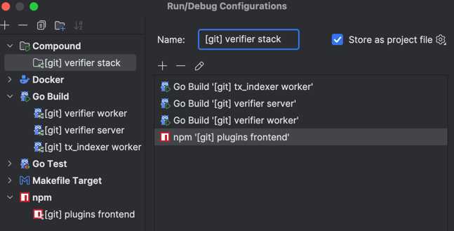
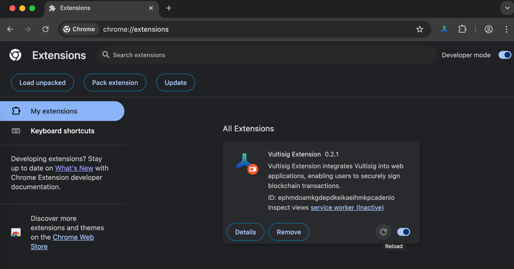

# Vultisig Verifier

A service providing threshold signature scheme (TSS) operations for vaults. Works with [Vultisig Plugins](https://github.com/vultisig/plugin) to process and sign blockchain transactions.

## Features

- Vault management (create, retrieve, manage)
- TSS operations with DKLS
- Transaction processing
- Policy enforcement
- Asynchronous processing

## Architecture

- **Core Components**: API server, Worker service, PostgreSQL/Redis storage
- **Integration**: Receives transactions from Plugins, processes them securely
- **Security Model**: Plugins handle business logic; Verifier manages cryptographic operations

## Setup

### Prerequisites
- Go 1.24.2+, PostgreSQL 14+, Redis 6+, Docker

### Quick Start
```bash
# create a shared network for docker containers
docker network create shared_network
# start verifier and worker in docker compose
make up

# seed the postgres database with initial data
make seed-db
```

To debug Docker containers in GoLand with breakpoints, [refer to this article](https://www.jetbrains.com/help/go/attach-to-running-go-processes-with-debugger.html).

For convenient usage of debug breakpoints in GoLand, you can start only infra/db with Docker, and backend services outside Docker. Configs shared in `.run` directory, all envs already configured correctly. It will run:
- Verifier Server (don't forget to set `http://localhost:8081` instead of `http://payroll-server:8080` in `plugins` table);
- Verifier Worker;
- Tx Indexer Worker;
- Plugins Frontend;



How to install dev version of Chrome extension from desired branch:

- Clone [vultisig-windows](https://github.com/vultisig/vultisig-windows) repo and checkout to desired branch;
- `yarn install` to install deps;
- `yarn run build:extension` to build Chrome extension files;
- Open Chrome and load extension there:
  - Open `chrome://extensions`;
  - Click `Developer mode` toggle at top-right;
  - Click `Load unpacked`;
  - Select `vultisig-windows/clients/extension/dist` folder;
  - Now you'll see Vultisig Extension at the extensions list;

To switch branch or update it: rebuild code and click `Reload` button near Vultisig Extension at the extensions list — Chrome would reload files from the same path;



### Configuration
You can configure the verifier and worker by modifying the following files:
- `verifier.example.json`
- `worker.example.json`
- `tx_indexer.example`

These files define settings for:
- Server (port, host)
- Database connection
- Redis connection
- Storage options (S3 or local)
- TSS parameters

Each service uses its corresponding example file as the default config.json in both production and development Docker configurations..

## API Endpoints

**Authentication:** 
- Auth: `/auth` (POST),
- Refresh: `/auth/refresh` (POST)

**Vault Management:**
- Reshare: `/vault/reshare` (POST)
- Get: `/vault/get/:pubKey` (GET)
- Check: `/vault/exist/:pubKey` (GET)

**Signing:**
- Sign: `/vault/sign` (POST)
- Get results: `/vault/sign/response/:id` (GET)

**Transactions:**
- Create: `/sync/transaction` (POST)
- Update: `/sync/transaction` (PUT)

## Development

**Key directories:**
- `/cmd` - Entry points (verifier, worker)
- `/internal` - Core implementation (API, services, storage)
- `/types` - Data structures
- `/vault` - Vault storage implementations

**Testing:**
```bash
# Unit tests
go test ./[path]/...

# Plugin integration tests
make test-integration                      # Run all tests
```

## License

See LICENSE file for terms.
